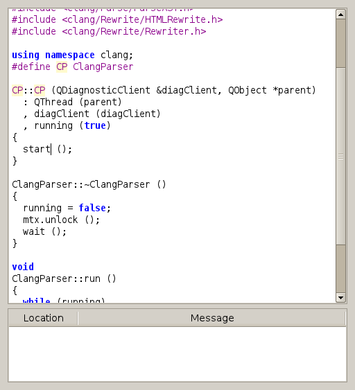
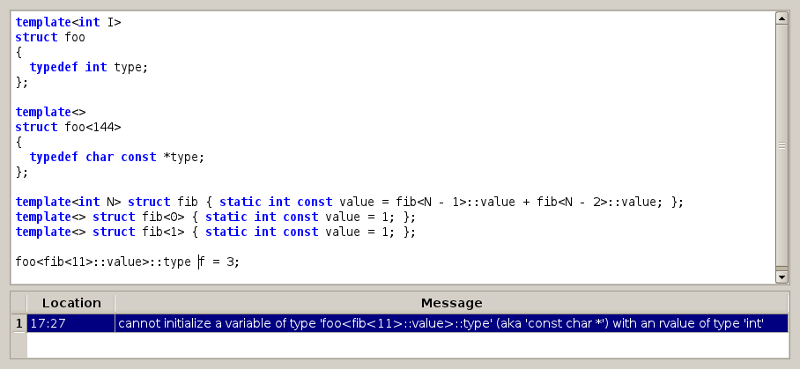

Clang IDE
=========

Tiny C++ editor with Clang integration.

[Git repository](https://github.com/pippijn/clangide)

Code editing
------------

ClangIDE is currently a very minimalistic C++ editor. It uses Clang for syntax
highlighting and direct feedback in case of errors. Since Clang's lexer
doesn't know which identifiers name types, there is no highlighting of user
defined types, yet.

Diagnostics
-----------

By double clicking the diagnostic, the editor jumps to the source location at
which the error/warning occurred.

